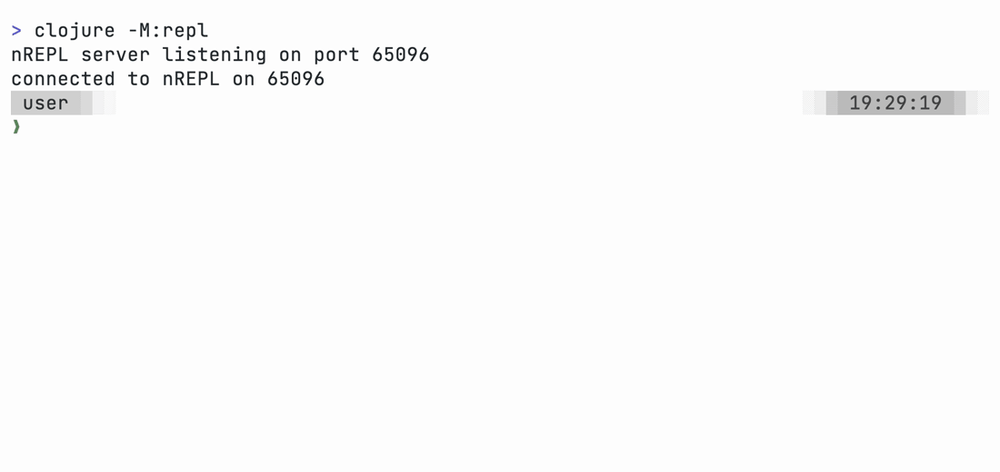
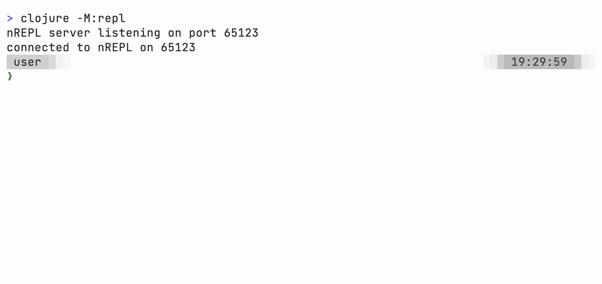
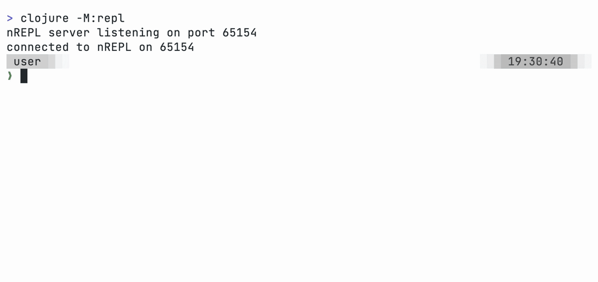
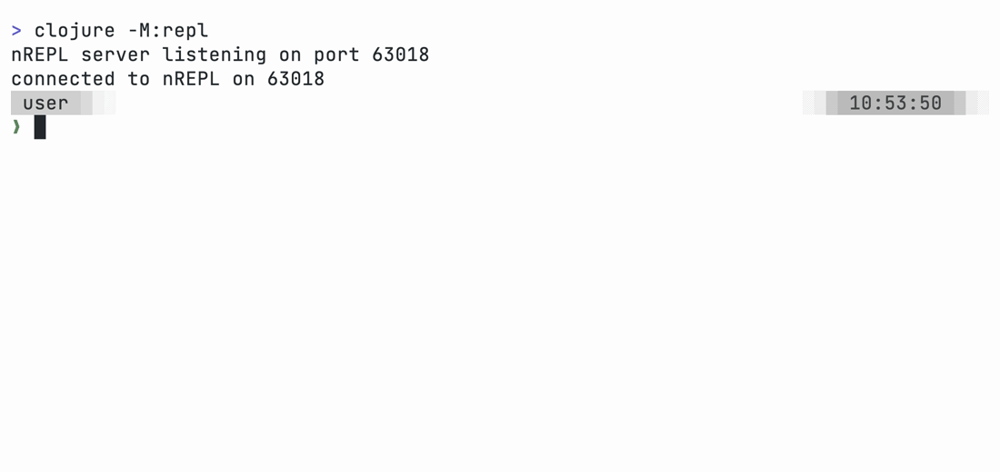
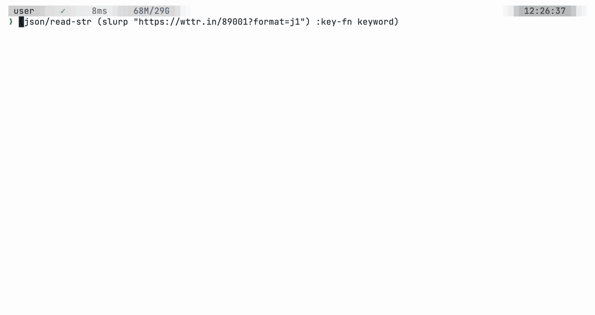

# clojure-cli.repl

A REPL for the Clojure CLI featuring multi-line editing with proper indentation,
bracket highlighting, structural editing, inline eval, doc lookup for Clojure
and Java, a data inspector, configurable prompts, keybindings, and much more.

It runs as two processes. An nREPL server that evaluates code, and a JLine client that
provides a terminal prompt. Separate processes keep the client dependencies
off the project classpath.

## Install

Until official release, add these aliases to your user `deps.edn`:

```clojure
{:aliases
 {:repl   {:replace-paths [] :main-opts ["-m" "clojure-cli.repl.server" "repl"]
           :replace-deps {clojure-cli.repl/server {:git/url "https://codeberg.org/JarrodCTaylor/clj-line.git"
                                            :git/sha "8d4b0ddd56c7f1db784d5b3585b069ce6d41b673" :deps/root "server"}}}
  :attach {:replace-paths [] :main-opts ["-m" "clojure-cli.repl.client"]
           :replace-deps {clojure-cli.repl/client {:git/url "https://codeberg.org/JarrodCTaylor/clj-line.git"
                                            :git/sha "8d4b0ddd56c7f1db784d5b3585b069ce6d41b673" :deps/root "client"}}}
  :serve  {:replace-paths [] :main-opts ["-m" "clojure-cli.repl.server"]
           :replace-deps {clojure-cli.repl/server {:git/url "https://codeberg.org/JarrodCTaylor/clj-line.git"
                                            :git/sha "8d4b0ddd56c7f1db784d5b3585b069ce6d41b673" :deps/root "server"}}}}}
```

**Note: Java 17+ is required**

## Run

* `clojure -M:repl` starts a server that spawns a client
* `clojure -M:serve` starts a server, writing its port to `.nrepl-port`
* `clojure -M:attach [port]` attaches a client, reading `.nrepl-port` when no port is given

## Example Config

The REPL offers many customization options. An [example config](examples/.cljconf) is provided
as a reference or starting point. Copy it into the project dir, or into
`~/.clojure` for use in all projects:

```
cp -R clj-line/examples/.cljconf .
```

## Demos

The example prompt displays the current ns, the outcome (✓|✗) and duration of the last eval, the server heap, and the wall clock:



Eval the form at the cursor without submitting the line:



Display Clojure or Java docs for the symbol at the cursor:



Structural editing:



Browse the last result, drill into nested data:



## Configuration

The REPL is highly customizable. Behavior can be [configured](doc/configuration.md) at the user level, project level, or both.

| Keys | Configure | Docs |
|------|-----------|------|
| `:prompt` | The prompt | [Prompts](doc/prompts.md) |
| `:middleware` | Server data on eval responses | [Middleware](doc/middleware.md) |
| `:keybindings` `:editing-mode` | Keys and widgets | [Keys](doc/keys.md) |
| `:paredit/<op>` `:bracket-pairs` `:eval-form-at-cursor` `:doc-at-cursor` | Editing | [Structural editing](doc/editing.md) |
| `:inspect` | Browse the last result | [Inspector](doc/inspector.md) |
| `:eval-hook` `:print-hook` `:caught-hook` | Server hooks | [Hooks](doc/hooks.md) |
| `:history` `:auto-require` `:port` and dynamic vars | Session behavior | [Configuration](doc/configuration.md) |


## Tests

```
cd client && clojure -M:test
```
