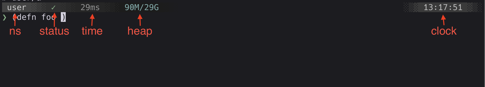

# Prompts

The `:prompt` config key names a zero-arg function with a qualified symbol:

```clojure
;; .cljconf/org.clojure/clojure-cli.repl.edn
{:prompt dev.prompt/prompt}
```

The function lives in the config directory's `src` and is called by the client
before each input line. The function should return the prompt as a vector of segments.

## Segments

A segment is a map of `:text` and an optional `:style`:

```clojure
(ns dev.prompt
  (:require [clojure-cli.repl.api :as api]))

(defn prompt []
  [{:text @api/current-ns :style {:fg :blue :bold true}}
   {:text " => "}])
```

Style keys: `:fg`, `:bg`, `:bold`, `:italic`, `:underline`, and `:inverse`.
Colors: `:black`, `:red`, `:green`, `:yellow`, `:blue`, `:magenta`, `:cyan`, `:white`,
and their `:bright-*` variants or an xterm 256 value (0-255).

A `{:text "\n"}` segment starts a new line and can be used to create multi-line prompts.

## REPL state

`clojure-cli.repl.api` holds client state a prompt can read:

* `current-ns`: An atom holding the name of the current namespace
* `last-response`: An atom holding the last eval's nREPL response. An `:ex` key is present if the eval threw an error.
* `terminal-width`: The current terminal column width.

The rest of the api namespace is documented with [keybindings](keys.md#the-api).

## Server data

To isolate dependencies, the prompt runs in a separate process from where code is evaluated.
[Middleware](middleware.md) is required to add server data to the prompt.

## Example



The example config has a [full-width prompt](../examples/.cljconf/org.clojure/clojure-cli.repl/src/dev/full_width_prompt.clj) that demonstrates using the api namespace
and middleware to supply the [time](../examples/.cljconf/org.clojure/clojure-cli.repl/src/dev/timing.clj) of the last eval and the [server heap](../examples/.cljconf/org.clojure/clojure-cli.repl/src/dev/heap.clj).

Copy the example dir into a project, or `~/.clojure` for user level installation:

```
git clone https://codeberg.org/JarrodCTaylor/clj-line.git
cp -R clj-line/examples/.cljconf .
clojure -M:repl
```
